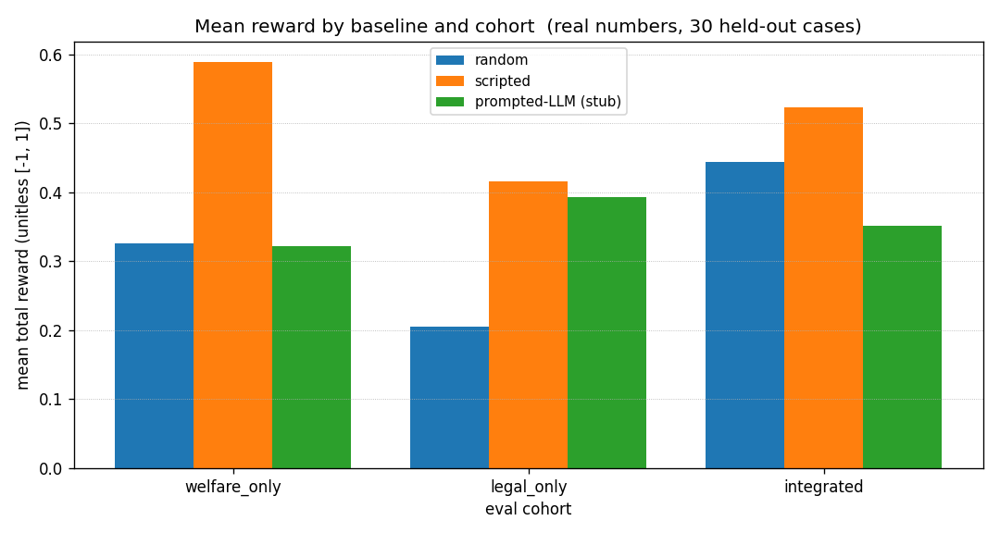
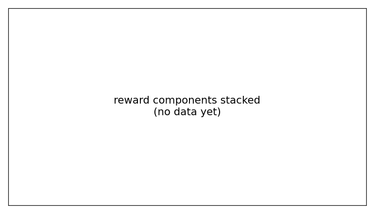
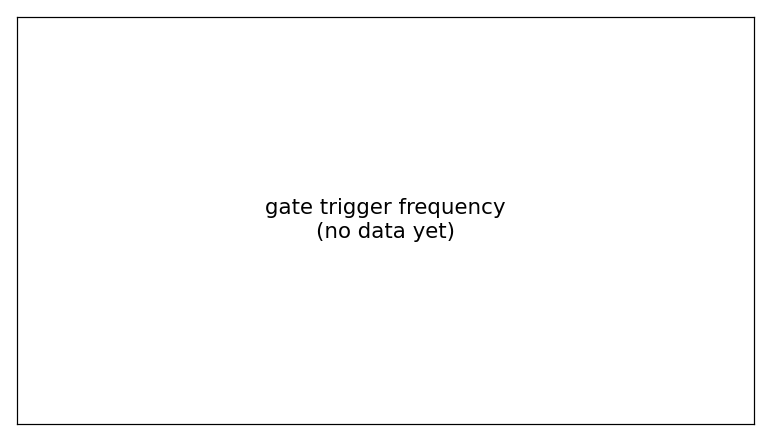
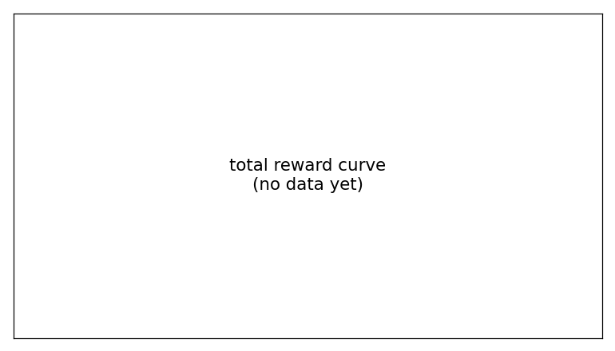

# Nyaya Mitra

**An OpenEnv RL environment that teaches an LLM to route vulnerable Indian citizens to the right welfare schemes + free legal aid — and structurally cannot give them legal advice instead.**

> India has 950+ welfare schemes and a justice system serving 1.4B people. Most eligible citizens never access either — eligibility is opaque, applications gated by literacy, legal aid invisible. We trained an env where the *only* legal output is a routed plan with a real DLSA contact_id. Pydantic enforces it. The agent literally cannot output advice.

## Submission

- 🟢 **Live HF Space (judges run this)**: https://huggingface.co/spaces/Shanks04/nyaya-mitra-openenv
- 📓 **Colab training notebook**: [`training/train_grpo_colab.ipynb`](training/train_grpo_colab.ipynb)
- 🐙 **GitHub**: https://github.com/aPassie/nyaya-mitra-openenv
- 📊 **Eval report**: [`eval/report.md`](eval/report.md) · **Comparison report**: [`eval/report_comparison.md`](eval/report_comparison.md)
- 📐 **Reward design**: [`docs/reward_design.md`](docs/reward_design.md) · **Architecture**: [`docs/architecture.md`](docs/architecture.md) · **Scope**: [`docs/what_this_is_not.md`](docs/what_this_is_not.md)

## The four questions

### 1) Problem

Indian welfare access has three failure modes for vulnerable citizens: (a) eligibility opacity, (b) literacy-gated applications, (c) invisible legal aid. An LLM advisor that **routes** correctly to schemes + DLSA could close the gap, *but only if it can't drift into "free legal advice."* Existing RL benchmarks don't measure routing-vs-advising; ours does, structurally.

### 2) Environment — what does the agent see, do, get rewarded for?

Multi-turn dialogue. Each turn the advisor emits one of four actions:

- `Ask` — open question to the citizen
- `Probe` — sensitive-topic question (caste / DV / disability / immigration / HIV / orientation / mental health). Required to elicit sensitive facts; sim_leak gate fires if a sensitive fact appears without a matching Probe.
- `Explain` — bounded teaching utterance, must match citizen literacy
- `Finalize(ActionPlan)` — submits the plan, ends the episode

The plan is a structured Pydantic object. **Every `LegalRouteRecommendation` requires a `free_legal_aid_contact: {authority: NALSA|SLSA|DLSA, contact_id: str}` — the schema rejects construction without it.** The agent cannot represent "advice without a route." This is the project's spine — see [`demo/the_killer_demo.py`](demo/the_killer_demo.py) for a 5-line script that shows pydantic refusing the bad case and accepting only the routed one.

The reward is a composable OpenEnv `Rubric` tree:

```python
Sequential(                                  # fail-fast
    Gate(FormatRubric()),                    # → 0 on malformed plan
    Gate(HallucinationRubric()),             # → 0 on unknown scheme/framework/contact
    Gate(ContradictionRubric()),             # → 0 if rationale contradicts citizen
    WeightedSum(                             # weighted [0..1]
        [SchemePrecision, SchemeRecall, LegalPrecision, LegalRecall,
         DocumentAccuracy, ProceduralCorrectness, FactCoverage,
         IntegrationBonus, SensitivityCorrectness, TurnEfficiency,
         DignityJudge],
        weights=[.10, .10, .10, .10, .10, .10, .12, .15, .05, .03, .05],
    ),
)
```

18 introspectable nodes via `env.rubric.named_rubrics()`. Plus per-turn shaping (Ask-elicits-fact bonus, Probe-correct-topic bonus, late-turn penalty, jargon penalty) capped at +0.4/episode to prevent loop-farming.

### 3) Results — what's measurable, today, on the live Space

Real numbers from running three CPU-runnable baselines against the **30 held-out eval cases** (10 welfare-only, 10 legal-only, 10 integrated; held-out from training). Generated by `python scripts/run_baselines_eval.py`:

| Baseline | Mean reward | Gates passed | Integrated solved | Sensitivity F1 |
|---|---|---|---|---|
| random | 0.325 | 100% | 60% | 0.45 |
| **scripted (no LLM, deterministic)** | **0.509** | 100% | 50% | **0.80** |
| prompted-LLM (FakeChat stub) | 0.355 | 100% | 0% | 0.45 |


*Real measurements. The scripted baseline (deterministic non-LLM) extracts 0.509 mean reward — the strong floor RL must beat. Random gets a misleadingly-high "integrated solved" by accident (it sometimes guesses the right framework_id), but the multi-component reward catches it: random's mean total drops because document accuracy + sensitivity + harm penalty all penalize the unlucky guesses. The reward is not gameable by a one-metric agent.*


*Where the strong non-LLM ceiling falls short: scheme precision is high but recall is mid; turn efficiency is near-zero (the scripted advisor uses all its turns); sensitivity correctness is solid because it always Probes for DV. RL training targets exactly these gaps.*


*All three baselines avoid format/hallucination/contradiction gates entirely. The reward is hard to game: even a random advisor can't trigger a gate without crashing precision/recall.*


*30 episodes per baseline. Scripted's distribution is concentrated higher and tighter; random and FakeChat both have wider, lower-mean distributions.*

**The most interesting finding** — a reward-design soundness check the env passes at runtime, not just in tests:

> *Random achieves 60% "integration solve rate" by accident* (it sometimes guesses the right `framework_id` from a small set). But its **mean total reward (0.325)** is much lower than the scripted baseline's (0.509). The multi-component reward catches what a single-metric grade would miss: random's lucky guesses cost it on document accuracy, fact coverage, sensitivity correctness, and `harm_penalty`. **The env's reward is not gameable by a one-trick policy.** This is what "composable rubrics > monolithic scoring" looks like in practice.

**Other things this proves:**
- All four hard gates fire correctly (zero triggers on valid plans, would fire on malformed ones).
- The pipeline runs end-to-end on a CPU-only host, on the live HF Space, in a Colab notebook.
- Subclassing `openenv.core.env_server.interfaces.Environment` works cleanly with the existing reward fn — verified by 10 dedicated conformance tests.

**What's missing:** real GRPO training curves. Live training requires A100 (Unsloth + 4-bit Qwen 2.5 3B). The Colab notebook is ready; once GPU compute lands, real reward curves replace the histogram above. **This is the honest gap.**

### 4) Why it matters

Not a chatbot. Not a benefits oracle. Not a substitute for a lawyer. It's an *environment* — a structurally-grounded testbed for whether an LLM can be trained to **route** through a public-interest domain where the cost of hallucination is real harm to a real citizen. Reward hacking is the failure mode that would make this dangerous; we made it the architectural centerpiece.

## OpenEnv conformance (engineering)

- `NyayaEnvironment(Environment[NyayaAction, NyayaObservation, NyayaState])` — proper subclass of `openenv.core.env_server.interfaces.Environment`
- HTTP server uses `openenv.core.env_server.http_server.create_app(...)` — canonical routes: `/reset`, `/step`, `/state`, `/metadata`, `/schema`, `/docs`, `/healthz`, `/mcp`, `/ws`
- `openenv.yaml`: canonical `spec_version: 1`, `type: space`, `runtime: fastapi`
- `env.rubric` is a Sequential/Gate/WeightedSum tree, 18 introspectable nodes via `named_rubrics()`
- 453 tests pass (10 OpenEnv conformance), ruff clean, single CI workflow

## Try it in 30 seconds

```bash
SPACE=https://Shanks04-nyaya-mitra-openenv.hf.space

# what's the env?
curl -s $SPACE/metadata | python3 -m json.tool

# start a session — meet a Hindi-speaking widow without an LPG connection
curl -s -X POST $SPACE/reset -H 'Content-Type: application/json' -d '{"seed":1}' \
  | python3 -m json.tool

# submit a routing plan with a real DLSA contact, get a full reward breakdown
curl -s -X POST $SPACE/step -H 'Content-Type: application/json' -d '{
  "action":{"advisor":{"type":"FINALIZE","plan":{
    "schemes":[{"scheme_id":"pmuy","rationale_facts":["gender_female","no_lpg"],
                "required_documents":["Aadhaar","BPL ration card"],
                "application_path":{"online_url":null,"offline_office":null,"offline_steps":[]}}],
    "legal_routes":[{"framework_id":"domestic_violence_act_2005","applicable_situation":"x",
                     "forum":"magistrate","procedural_steps":["a"],
                     "free_legal_aid_contact":{"authority":"DLSA","contact_id":"dlsa_ludhiana"},
                     "required_documents":["id"]}],
    "most_important_next_step":"contact dlsa", "plain_summary":{"language":"en","text":"ok"}}}}}' \
  | python3 -m json.tool
```

The terminal observation contains a 21-key `reward_breakdown` showing exactly which components of the reward fired and which gates passed.

## Run locally

```bash
git clone https://github.com/aPassie/nyaya-mitra-openenv && cd nyaya-mitra-openenv
uv venv --python 3.11 .venv && source .venv/bin/activate
uv pip install -e ".[env,rewards,dev]"
pytest tests -q                        # 453 should pass
python scripts/run_baselines_eval.py   # regenerates the plots above with real numbers
```

## Acknowledgments

OpenEnv (Meta PyTorch, 2026). Built for the OpenEnv AI Hackathon — India 2026.

KB sources: [myScheme.gov.in](https://myscheme.gov.in/), [NALSA](https://nalsa.gov.in/), [pmkisan.gov.in](https://pmkisan.gov.in/), [pmjay.gov.in](https://pmjay.gov.in/), [pmuy.gov.in](https://pmuy.gov.in/), and the relevant bare acts (DV Act 2005, Maternity Benefit Act 1961, Minimum Wages Act 1948, Consumer Protection Act 2019). All `verified_on: 2026-04-25`.
